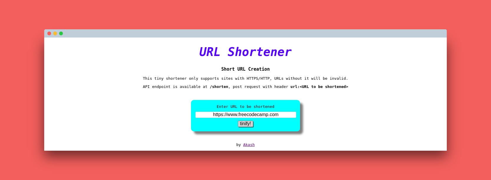

# url-shortener

A simple url shortener for the people who like their coffee hot and url short

check it out [here](https://bumpy-eye.glitch.me/)



## Gettin' Started

- clone this repo using ```git clone```
- make ```url-shortener``` your current directory
- run ```npm install```
- ```npm start``` to start your local server

## Structure

On the front-end : `public/style.css` and `views/index.html`
On the back-end : app starts at `server.js`

Made by [Akash Gajjar](https://github.com/skywalker212)

-------------------

\ ゜o゜)ノ
